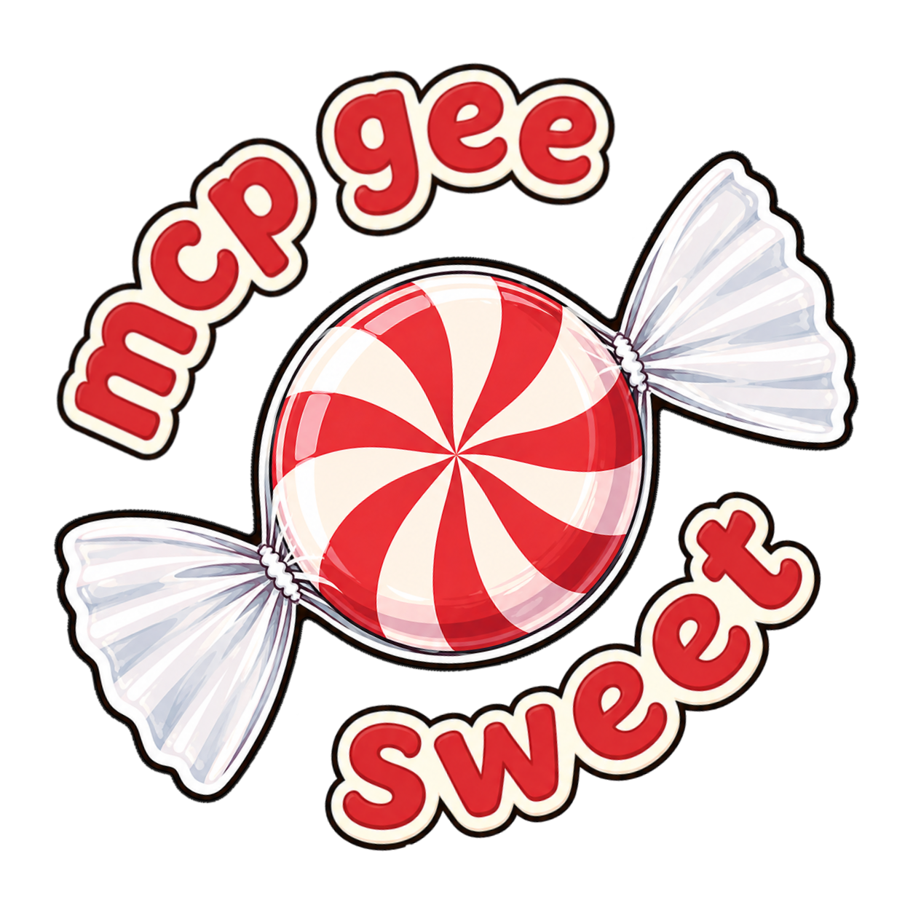

<div align="center">
  

  <b>mcp-gee-sweet</b>
  <p align="center"><i>The Google Workspace MCP server built for depth.</i></p>


</div>

<!-- mcp-name: io.github.khuisman/mcp-gee-sweet -->

Google ships its own Sheets and Docs MCP servers now (Developer Preview), but they're shallow — thin CRUD, both approval-gated. mcp-gee-sweet goes deeper: raw formula access — reads `=VLOOKUP()` and friends directly, structural Docs support (colspan/rowspan tables, themes, named styles, an HTML/Markdown→AST→Docs pipeline), plus complete Drive and Calendar coverage Google's preview doesn't touch at all.

A few things no other Workspace MCP has:
- **Caching** — repeated reads return in ~2ms from a local cache instead of a round-trip API call every time.
- **Formula access** — reads raw `=VLOOKUP()`, `=SUM()`, and `=IF()` expressions, not just the values they produce.
- **Local sync** — two-way sync between a local folder and Google Drive.

**Install (stable):**
```bash
uvx mcp-gee-sweet
```

**Install (bleeding edge — every code change on `develop`):**
```bash
uvx --prerelease=allow mcp-gee-sweet
```

**[Full documentation →](https://khuisman.github.io/mcp-gee-sweet/)**

---

## What's covered

| Service | Tools | Google's own MCP | Highlights |
|---|---|---|---|
| **Google Sheets** | 35 | 6 | Formula access, batch read/write, 8 chart types, structural ops |
| **Google Drive** | 38 | — | File ops, sharing/permissions, local sync, revision history |
| **Google Docs** | 34 | 2 | Full HTML→Doc pipeline, tables, range styling, themes, Markdown export |
| **Google Calendar** | 17 | — | Event CRUD, free-slot finder across multiple calendars |

---

## Quick start

### Option A: `uv` — local use and development

If you cloned the repo or just want to use the server from your machine, `uv` is all you need. No Docker required.

```bash
git clone https://github.com/khuisman/mcp-gee-sweet.git
cd mcp-gee-sweet
uv sync
```

Then point your MCP client at it using **stdio transport** (see [MCP client config](#mcp-client-config) below). The client spawns the server as a subprocess on demand — each session gets its own isolated process, so restarting the server for a code change or config update doesn't affect other open sessions.

### Option B: Docker — persistent shared server (SSE)

Use Docker when you want a single long-running server that multiple clients connect to over SSE — for example, Claude Desktop talking to the same instance as Claude Code.

```bash
git clone https://github.com/khuisman/mcp-gee-sweet.git
cd mcp-gee-sweet
make build   # build the container image
make start   # start the server (SSE on port 47000)
make logs    # tail logs
```

Point your MCP client at `http://localhost:47000/sse`.

> **Note:** when using SSE, all clients share one server process. After a code change or restart (`make restart`), you must also restart each MCP client to reconnect.

---

## Configuration

The server tries auth methods in a waterfall by default, OAuth first — it authenticates as you and has full personal Drive access, which is what local/dev use (Option A above) needs. For OAuth, download an OAuth Client ID JSON from GCP Console and point the server at it:

```bash
export CREDENTIALS_PATH="/path/to/credentials.json"
```

Service accounts (recommended for headless server deployments — see Option B above), base64 credential injection, and Application Default Credentials are also supported. See [Authentication](https://khuisman.github.io/mcp-gee-sweet/latest/auth/) for all options.

---

## MCP client config

**Claude Desktop — stdio (cloned repo):**
```json
{
  "mcpServers": {
    "mcp-gee-sweet": {
      "command": "uv",
      "args": ["run", "--directory", "/path/to/mcp-gee-sweet", "mcp-gee-sweet"],
      "env": {
        "CREDENTIALS_PATH": "/path/to/credentials.json"
      }
    }
  }
}
```

**Claude Desktop — SSE (Docker):**
```json
{
  "mcpServers": {
    "mcp-gee-sweet": {
      "transport": "sse",
      "url": "http://localhost:47000/sse"
    }
  }
}
```

See [Client Setup](https://khuisman.github.io/mcp-gee-sweet/latest/client-setup/) for more options including tool filtering.

---

## Docs

- [Tools](https://khuisman.github.io/mcp-gee-sweet/latest/tools/) — full tool reference, grouped by domain
- [Authentication](https://khuisman.github.io/mcp-gee-sweet/latest/auth/) — all four auth methods
- [Configuration](https://khuisman.github.io/mcp-gee-sweet/latest/configuration/) — env vars, caching, tool filtering
- [Client Setup](https://khuisman.github.io/mcp-gee-sweet/latest/client-setup/) — MCP client config examples
- [Design Principles](https://khuisman.github.io/mcp-gee-sweet/latest/design/) — tool inclusion policy, composite tool decisions
- [Roadmap](https://khuisman.github.io/mcp-gee-sweet/latest/roadmap/) — planned features and known gaps

---

## Contributing

See [CONTRIBUTING.md](CONTRIBUTING.md) for setup, QA workflows, and PR guidelines. A signed-off [`docs/qa/runs/vX.Y.Z.md`](docs/qa/runs) record is required before any stable PyPI release — see [`docs/qa/README.md`](docs/qa/README.md) for the QA workflow.

## License

MIT — see [LICENSE](LICENSE).

## Credits

- [xing5/mcp-google-sheets](https://github.com/xing5/mcp-google-sheets) — upstream this project was forked from
- [FastMCP](https://github.com/cognitiveapis/fastmcp)
- [freema/mcp-gsheets](https://github.com/freema/mcp-gsheets) and [piotr-agier/google-drive-mcp](https://github.com/piotr-agier/google-drive-mcp) — roadmap inspiration
